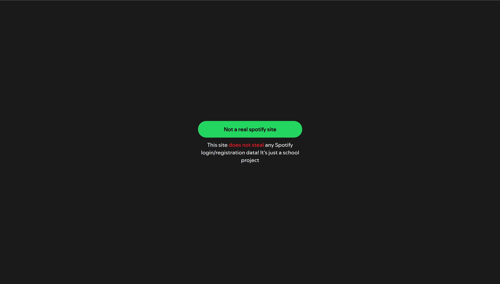
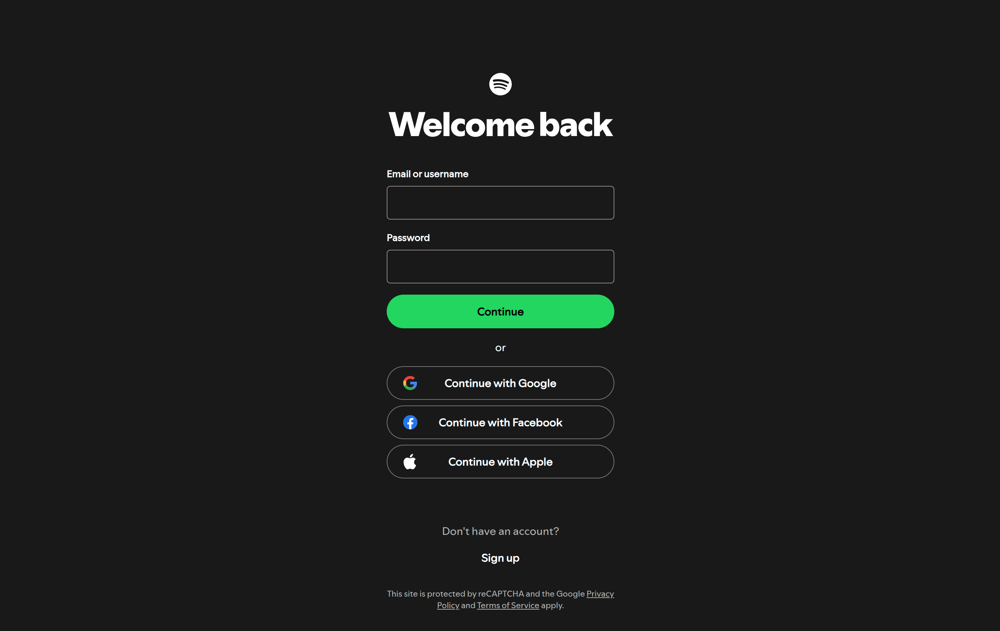
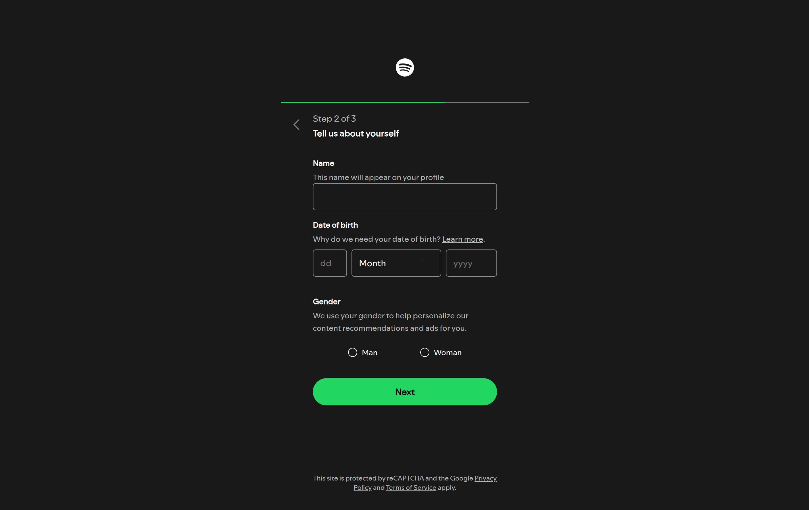
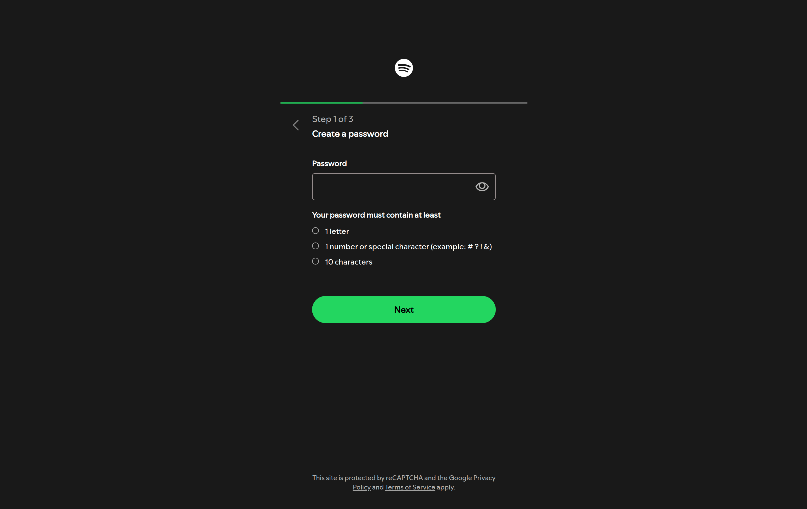

## Spotify Web Experience Clone

A pixel-close recreation of Spotify's marketing splash page, login flow, and three-step account creation funnel. The project is entirely static (HTML, CSS, JavaScript) yet captures the feel of the official site, including inline validation, progressive disclosure of form steps, and contextual warnings.

### Table of Contents
- [Features](#features)
- [Screenshots](#screenshots)
- [Tech Stack](#tech-stack)
- [Project Structure](#project-structure)
- [Setup and Usage](#setup-and-usage)
- [Key Scripts](#key-scripts)
- [Styling Notes](#styling-notes)
- [Future Improvements](#future-improvements)
- [License](#license)

### Features
- **Landing + Auth Pages** – `index.html` mirrors the public marketing hero; `sites/login.html`, `sites/registration.html`, and `sites/registration-password.html` replicate the authentication views with matching typography and spacing.
- **Interactive Validation** – Custom scripts add `blur` and `input` handlers that toggle `.touched`, `.hidden`, and `.warning` utility classes so errors appear instantly.
- **Password Coach Marks** – The password step highlights requirements (letter, number/special char, minimum length) with live SVG swaps and red state text.
- **Progress Indicators** – A progress bar plus “Step x of y” copy guide people through the registration funnel.
- **Responsive Layouts** – Independent stylesheets for landing, login, creation, and shared fonts keep the UI adaptable across viewports without a framework.
- **Navigation Helpers** – Lightweight helpers route users to the next step or open supporting pages without leaving the experience.

### Screenshots
Screenshots live in `assets/`. Update filenames or add more images as needed.

**Landing Page** – hero layout with mirrored Spotify messaging, CTA buttons, and footer links.


**Login Form** – email/password inputs, warning banner, and toggle icons for password visibility.


**Registration Step** – email + username collection form with inline validation hints and warning blocks.


**Registration Alternate Step** – variation of the registration UI showcasing alternative warning states.


**Password + Profile Step** – password checklist, profile fields, date picker, and gender radios with progress bar.


### Tech Stack
- HTML5 for structure and semantic layout
- CSS3 (Flexbox, custom properties, animations) for styling
- Vanilla JavaScript for form validation, alerts, and UI transitions

### Project Structure
```
website-copy-project/
├── index.html
├── sites/
│   ├── login.html
│   ├── registration.html
│   └── registration-password.html
├── styles/
│   ├── createAcc.css
│   ├── fonts.css
│   ├── index.css
│   ├── login.css
│   └── registration.css
├── js/
│   ├── emailValidity.js
│   ├── formCheck.js
│   ├── loginAlert.js
│   ├── nextStep.js
│   ├── openNewPage.js
│   ├── passwordValidity.js
│   ├── registrationAlert.js
│   ├── togglePassword.js
│   └── usernameValidity.js
└── assets/
	 ├── landing.png
	 ├── login.png
	 ├── registration.png
	 ├── registration-other.png
	 └── registration-password.png
```

### Setup and Usage
1. **Clone the repository**
	```bash
	git clone https://github.com/majtobijakodric/website-copy-project.git
	cd website-copy-project
	```
2. **Launch a static server** (pick one):
	- VS Code Live Server extension
	- Python: `python -m http.server 5173`
	- Node: `npx serve .`
	- Or open `index.html` directly in a browser (best results with a server to preserve relative links)
3. **Explore the flow**:
	- `index.html` → CTA buttons
	- `sites/login.html` → email/password validation + password toggle
	- `sites/registration.html` → email/username stage
	- `sites/registration-password.html` → password coach marks → profile details → confirmation step

### Key Scripts
| Script | Responsibility |
| --- | --- |
| `emailValidity.js` | Applies `.touched` state, shows/hides warning helper text when emails fail native validation. |
| `passwordValidity.js` | Evaluates password rules, swaps SVG indicators, and toggles outlines on invalid input. |
| `usernameValidity.js` | Ensures username fields gain `.touched` styling after blur for consistent feedback. |
| `togglePassword.js` | Switches password visibility icons and input type between `password` and `text`. |
| `formCheck.js` / `registrationAlert.js` / `loginAlert.js` | Provides alert messaging and lightweight form submission handling for the clone experience. |
| `nextStep.js` / `openNewPage.js` | Handles client-side navigation between steps/pages without a backend. |

### License
MIT License. See `LICENSE` for details.

